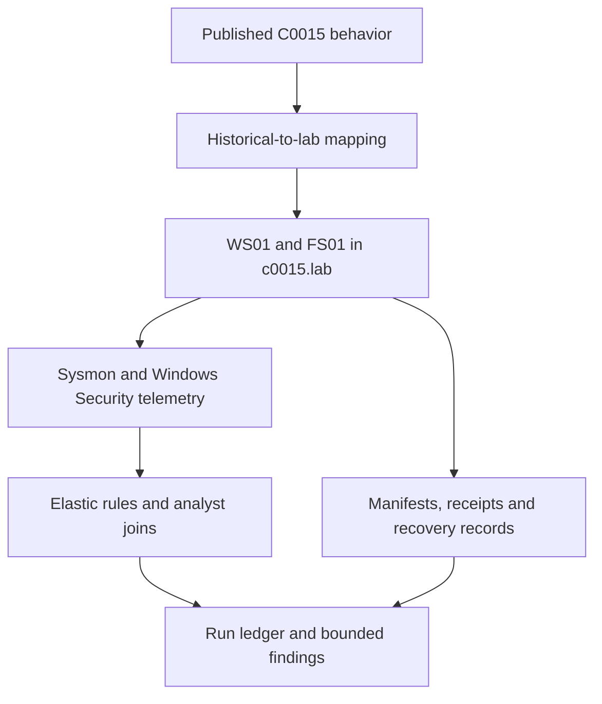

# C0015 Detection Engineering Lab

An evidence-driven reconstruction of selected behaviors from **MITRE ATT&CK Campaign C0015 (Conti/Bazar)** in a Windows and Active Directory homelab. The project connects the published intrusion narrative to laboratory mechanisms, Sysmon/Windows telemetry, Elastic Security detections, and reproducible evidence checks.

**24 rules (23 EQL + 1 KQL threshold) · 5 retained runs · Latest: RUN-20261002-09**

## Start here

| Reading goal | Entry point |
|---|---|
| Understand the project and its research questions | [Research overview](docs/research/overview.md) |
| Read the study in order | [Technical reading guide](docs/README.md) |
| Inspect the latest execution | [RUN-09 report](reports/reference-run-20261002-09.md) · [ledger](evidence/runs/RUN-20261002-09/RUN-20261002-09.json) |
| Evaluate the detections | [Rule catalogue](detections/README.md) · [correlation design](docs/detection/correlation.md) |
| Check what is proved and what remains open | [Validation and limitations](docs/validation/README.md) |

## Study at a glance



The campaign map covers **S1–S14**. S15 in retained ledgers is post-run validation. DC01 provides directory services; the operator host provides C2-SIM and an internal WebDAV sink. [Topology and configuration](docs/lab/architecture.md) · [Detailed architecture diagram](docs/lab/architecture-overview.md).

## Latest recorded findings

Source: [RUN-20261002-09 report](reports/reference-run-20261002-09.md), 2 October 2026, **12:55–13:35 UTC**.

| Finding | Evidence | Scope |
|---|---|---|
| S6 executed a target decision for FS01 | ART-06-02 in RUN-09 | Fixed scenario target; discovery-derived selection is unproven. Runs 05–08 retain NOT RUN. |
| WMI-spawned rundll32 loaded the pivot DLL | Sysmon E1/E7 and recorded SHA-256 | Proxy execution with a surrogate; module load does not establish process injection. |
| Two transfer rounds matched the collection set | ART-08-01 and both ART-09-01 receipts | 11 files / 309 bytes per round to the internal sink. |
| RDP Type-10 logon and logoff were joined | 4624/4634 on FS01, same TargetLogonId | S12 remains PARTIAL: reconnect/disconnect are not separately verified. |
| Bounded impact was reversed | ART-14-01 and bidirectional hash comparison | 15-file laboratory corpus. |

The [run index](reports/README.md) distinguishes the latest replay from **RUN-07**, the rule-tuning reference. Stored alerts, unique activity, stage status and overall verifier acceptance are reported separately.

## Detection and evidence

**R17, R18 and R23** are alerting rules; the other **21** are building blocks. [Queries](detections/queries/) and [NDJSON exports](detections/exports/) retain their existing rule IDs and paths. The catalogue documents import, telemetry dependencies and interpretation.

[Evidence records](evidence/README.md) link source event IDs and UTC timestamps to artifacts and sink receipts. Historical observations, inferred campaign details and laboratory surrogates have explicit labels in the [campaign mapping](docs/research/campaign-mapping.md). Original WMI credential provenance remains unknown; pre-provisioned laboratory credentials do not resolve it.

## Reproduce the checks

From the repository root:

```bash
python -m unittest discover -s scripts/tests
```

These are **20 offline component tests**. Live verification additionally needs retained Elastic telemetry, runtime C2 records and the documented environment. See [validation procedures and prerequisites](docs/validation/README.md) before interpreting a result as live acceptance.

## Repository map

| Location | Contents |
|---|---|
| [docs/](docs/README.md) | Ordered study: research, laboratory design, detection and validation |
| [detections/](detections/README.md) | Rule catalogue, query sources and import bundles |
| [reports/](reports/README.md) · [evidence/](evidence/README.md) | Run-specific findings and their supporting records |
| [configs/](configs/README.md) | Recorded Sysmon profiles |
| [payloads/](payloads/README.md) · [scripts/](scripts/README.md) | Existing scenario components and evidence tooling |
| [phases/](phases/README.md) | Development-phase narratives, with historical design context |

## Sources

[MITRE C0015](https://attack.mitre.org/campaigns/C0015/) · [The DFIR Report, 29 November 2021](https://thedfirreport.com/2021/11/29/continuing-the-bazar-ransomware-story/) · [Source register and citation conventions](docs/research/references.md).

Licensed under [MIT](LICENSE).
