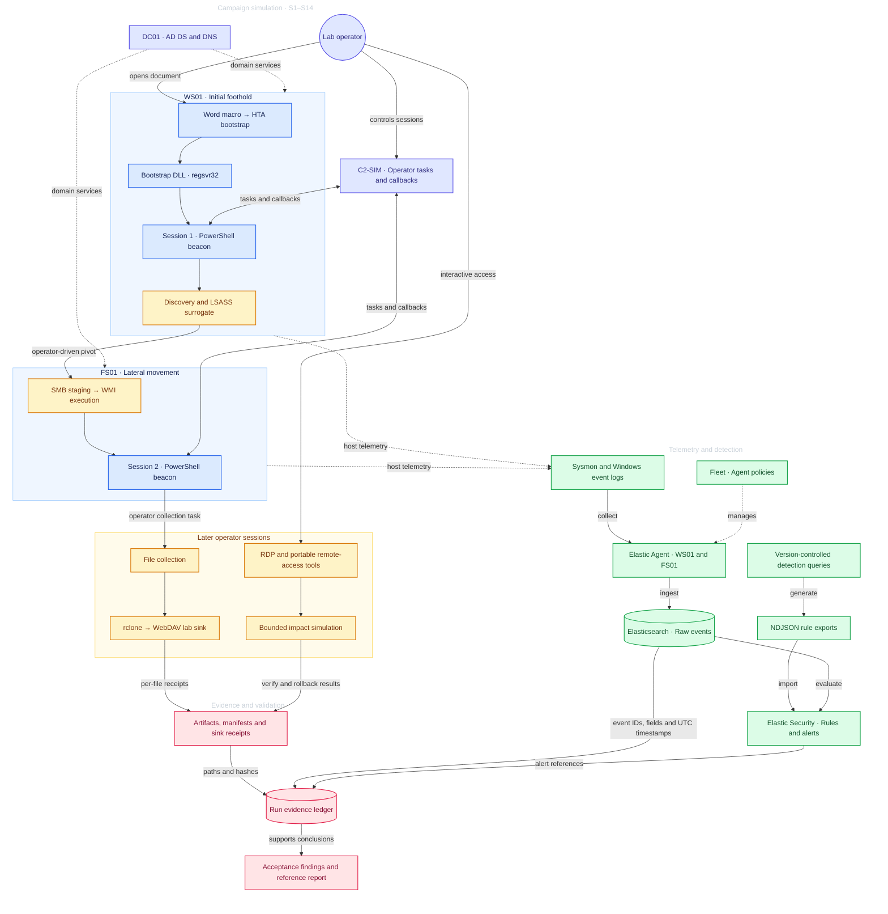

# Detailed architecture overview

[Reading guide](../README.md) · [Configuration and identities](architecture.md)

Fleet manages endpoint policies. Elastic Agents collect Sysmon and Windows Security events and send
them to Elasticsearch, where Elastic Security evaluates the detection rules. The evidence ledger connects
source events and alerts with the artifacts produced during each run.

| System | Role | Lab address |
|---|---|---|
| WS01 | Windows 10 workstation; initial foothold and session 1 | `192.168.50.20` |
| FS01 | Windows 10 Pro file server; Finance/IT data, WMI pivot, and session 2 | `192.168.50.30` |
| DC01 | AD DS and DNS for `c0015.lab` | `192.168.50.10` |
| Windows host | Operator, HTTP staging, C2-SIM, and WebDAV sink | `192.168.50.1` |
| Kali | Auxiliary tooling and Tailscale routing | `192.168.50.100` |
| ELASTIC01 | Elasticsearch, Kibana, and Fleet Server | Tailscale `100.77.46.126` |

The domain network uses VMware VMnet2 (`192.168.50.0/24`, host-only). WS01 and FS01 also have
NAT adapters for installation and updates. The Windows host serves HTTP staging on `:8000`, C2-SIM
on `:8080`, and the WebDAV sink on `:9001`. Endpoint telemetry uses the Elastic namespace `c0015`.
